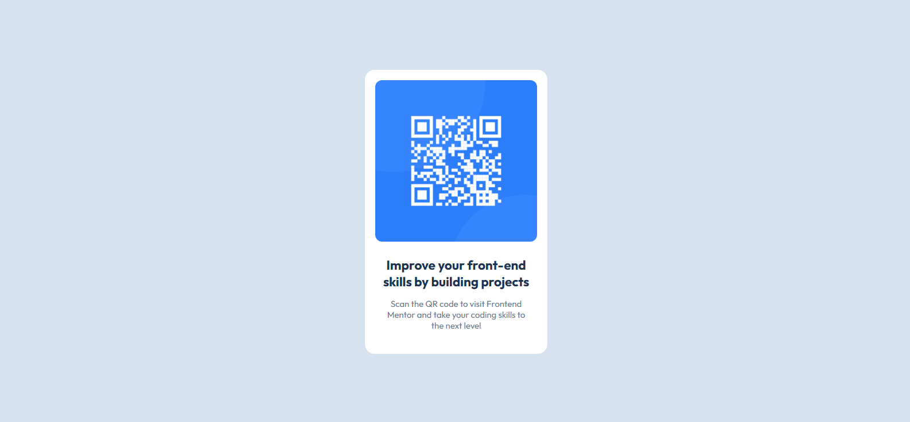

# Frontend Mentor - Solução de componente de código QR

Esta é uma solução para o [desafio de componente de código QR no Frontend Mentor] feita por Luísi Di Carlo.

## Visão geral
O projeto "QR Code Component" do Frontend Mentor consiste na criação de um cartão de apresentação mais parecido possivel com o design disponibilizado. O desafio foca no uso de HTML e CSS para construir a estrutura e estilizar o layout de maneira responsiva.Este projeto oferece uma ótima oportunidade para praticar design minimalista e a aplicação de boas práticas de desenvolvimento front-end.

### Captura de tela

### Construído com

-Ferramentas HTML e Css.

### Conclusão 
Como iniciante na área, tive algumas dificuldades simples, mas com um olhar mais atento consegui ver onde estava errando ou falhando em melhorar. Recomendo a todos que usem o Frontend Mentor para praticar e melhorar seus conhecimentos.

//***Feito por Luisi Di Carlo***//